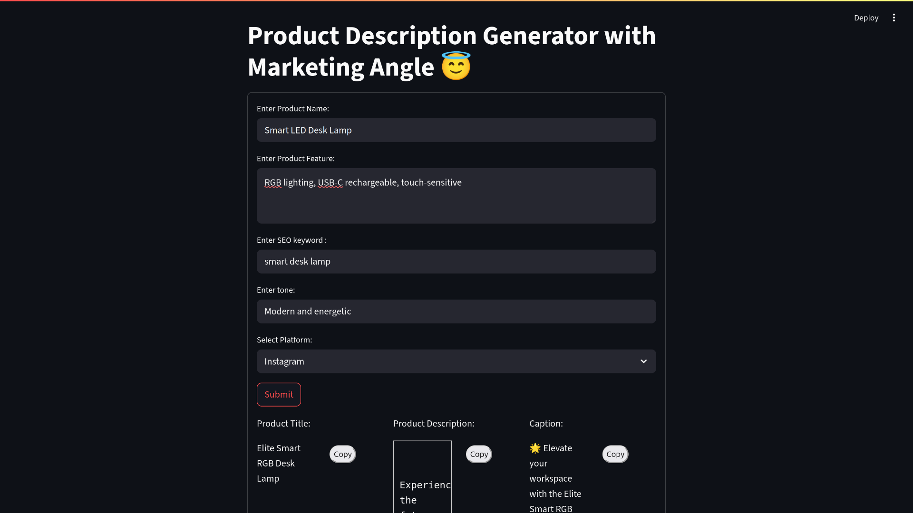
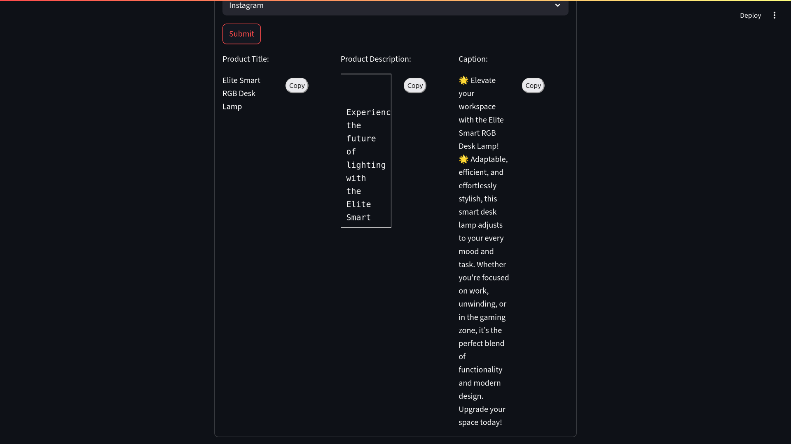

# 🛍️ Product Title & Description Generator with Marketing Angle

A powerful, AI-assisted web application built with **Streamlit** and **LangChain**, designed to help e-commerce businesses generate **creative product titles** and **persuasive, SEO-friendly product descriptions** at scale.

---

## 📌 Problem Statement

Writing compelling product descriptions that are SEO-optimized and consistent in tone is a major challenge for e-commerce businesses, especially when handling large catalogs. Manual writing is:

- Time-consuming  
- Inconsistent in tone  
- Not always optimized for conversion  

---

## 🎯 Goal

To automate the generation of:

1. A **premium-sounding product title**
2. A **marketing-optimized product description**

Using minimal inputs such as product name and features, and leveraging a `SequentialChain` with the **Groq LLM (DeepSeek model)**.

---

## 🚀 Features

- 📄 Accepts **product name** and **key features**
- 🔍 Includes **SEO keyword** for search optimization
- 🎭 Allows selection of **tone** (e.g., witty, luxurious, bold)
- 📱 Adapts to the **target platform** (e.g., Website, App, Social Media)
- 🧠 Uses **LangChain PromptTemplate** and **Groq LLM API**
- 📋 Provides **Copy to Clipboard** button for both outputs
- 🧾 Displays description in a **scrollable container**
- 💡 Optimized for productivity and real-time generation

---

## 🖥️ Tech Stack

| Component         | Technology       |
|------------------|------------------|
| Frontend/UI      | Streamlit        |
| LLM              | Groq (DeepSeek)  |
| Prompt Chaining  | LangChain        |
| Environment Vars | python-dotenv    |

---

## 🧪 Sample Inputs

| Input Type     | Example                                              |
|----------------|------------------------------------------------------|
| `Product Name` | Smart LED Desk Lamp                                  |
| `Features`     | RGB lighting, USB-C rechargeable, touch-sensitive    |
| `SEO Keyword`  | smart desk lamp                                      |
| `Tone`         | Modern and energetic                                 |
| `Platform`     | Instagram                                            |

---

## 📂 Project Initialization:

#### For mac/Linux
``` bash
python3 -m venv .venv
source .venv/bin/activate  
````
#### On Windows: 
```bash
python -m venv .venv
.venv\Scripts\activate
```

#### Install Dependencies
```bash
pip install -r requirements.txt
```

#### Add Your Groq API Key to
 create a .env file or rename the .env.sample file to .env


#### Run the App

```bash
streamlit run solution.py
```

## You can also take a look of the ipynb (notebook) file for without streamlit configurations and code

#### to use the ipynb file you need to install ipykernel
```bash
pip install ipykernel
```

## Sample Pics:

<table> <tr> <td align="center"> <br/> <strong>🔤 Input Form</strong><br/> User provides product name, features, SEO keyword, tone, and target platform. </td> <td align="center"> <br/> <strong>🧾 AI Output</strong><br/> Auto-generated product title, description, and social caption with copy buttons. </td> </tr> </table>